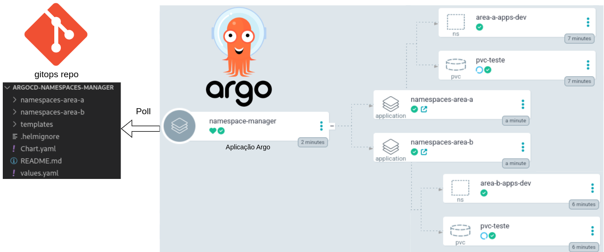
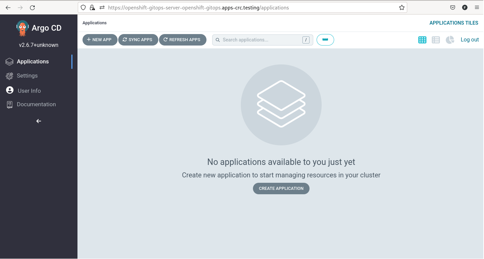
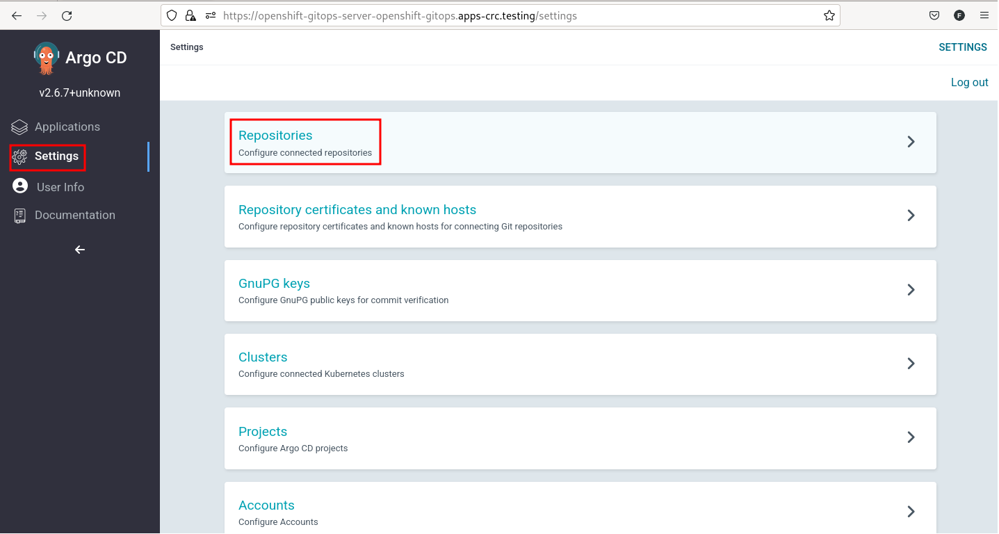
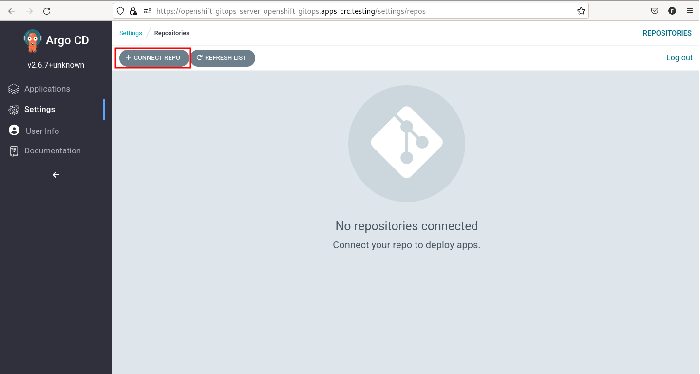
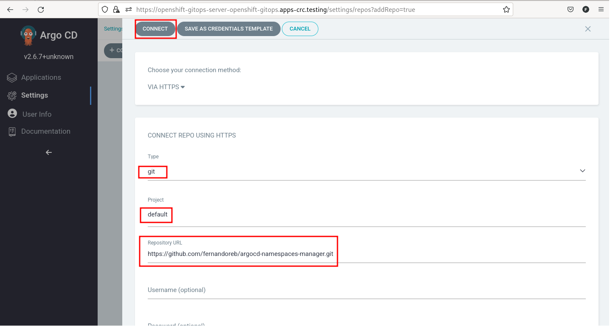
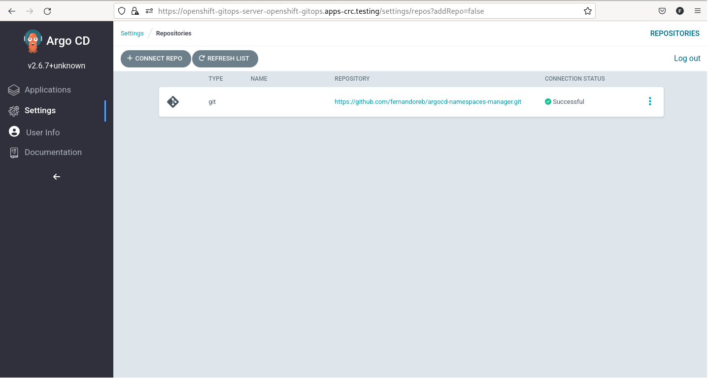

# Gitops - ArgoCD para gestão de Namespaces

Demostração de como utilizar o ArgoCD para gestionar namespaces com Openshift

## Motivação

As vezes não queremos deixar a cargo dos times de desenvolvimento a criação de namespace, Storage Claim, Roles e outros recursos do cluster.  
Podemos utilizar o ArgoCD para fazer essa adminstração. Criando uma ou mais aplicações no Argo, para fazer a gestão de namespaces.  

Imaginemos um cenário onde as áreas A e B necessitam criar namespaces para as suas aplicações e criar um pvc. Poderíamos resolver com ArgoCD da seguinte forma:

## Laboratório

Openshift: 4.12 - Versão CRC

Seguem os passos para execução do laboratório.

### Arquivos do Projeto

Se pegarmos um dos diretórios das áreas, poderemos ver em values a estrutura:

namespaces-area-a/values.yaml
~~~
# Lista de namespaces a serem criados. Executar uma vez para criar os namespaces e depois criar os demais itens
namespaces:
  - area-a-apps-dev

# Lista de sufixos que serão aplicados como zonas
nodeSelectorNS:
  - dev
  - hmg
  - prd

pvcsByNS:
  - namespace: area-a-apps-dev
    pvcname: pvc-teste
    size: 1Gi
    accessMode: ReadWriteOnce
    storageClassName: crc-csi-hostpath-provisioner
~~~

Neste caso, criaremos uma namespace e um pcv. A estrutura permite a criação de várias namespaces e pvcs. Ainda estamos associando a uma zona se o sufixo conincidir com as zonas listas na tag nodeSelectorNS.
 
 É possível validar essa implementação em:  
 
 namespaces-area-a/templates/namespace.yaml
 ~~~
 {{ if .Values.namespaces }}

{{ range $namespace := .Values.namespaces }}

{{ $sufix := "default" }}

{{ if $.Values.nodeSelectorNS }}
{{ range $sufixTemp := $.Values.nodeSelectorNS }}

{{ if hasSuffix $sufixTemp $namespace }}

{{ $sufix = $sufixTemp }}

{{ end }}

{{ end }}
{{ end }}

{{ if eq "default" $sufix }}
---
apiVersion: v1
kind: Namespace
metadata:
  name: {{ $namespace }}
  annotations:
    helm.sh/resource-policy: keep
  labels:
{{ include "argocd-applications-manager.defaultLabels" . | indent 4 }}  
{{ else }}
---
apiVersion: v1
kind: Namespace
metadata:
  name: {{ $namespace }}
  annotations:
    helm.sh/resource-policy: keep
    openshift.io/node-selector: 'zone={{$sufix}}'
  labels:
{{ include "argocd-applications-manager.defaultLabels" . | indent 4 }}  

{{ end }}

{{ end }}
{{ end }}
~~~

### Instalação

Instalar o **Operator Red Hat OpenShift GitOps**, via Web Console   

Referência: 
https://docs.openshift.com/container-platform/4.12/cicd/gitops/installing-openshift-gitops.html

### Criação da aplicação de manutenção de namespaces: 

Após instalado, acesse o ArgoCD de acordo com a documentação oficial. Teremos algo como:

#### Adicionando o Repositório Git

Vá em Settings e Repositories

Selecione Connect Repo

Adicione as informações do repo e Connect. Pode-se utilizar um repo privado, bastando informar o usuário e senha.

No final o repositório será adicionado com sucesso.
