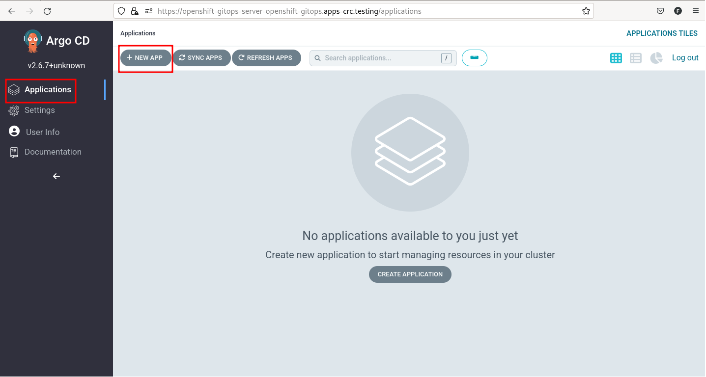
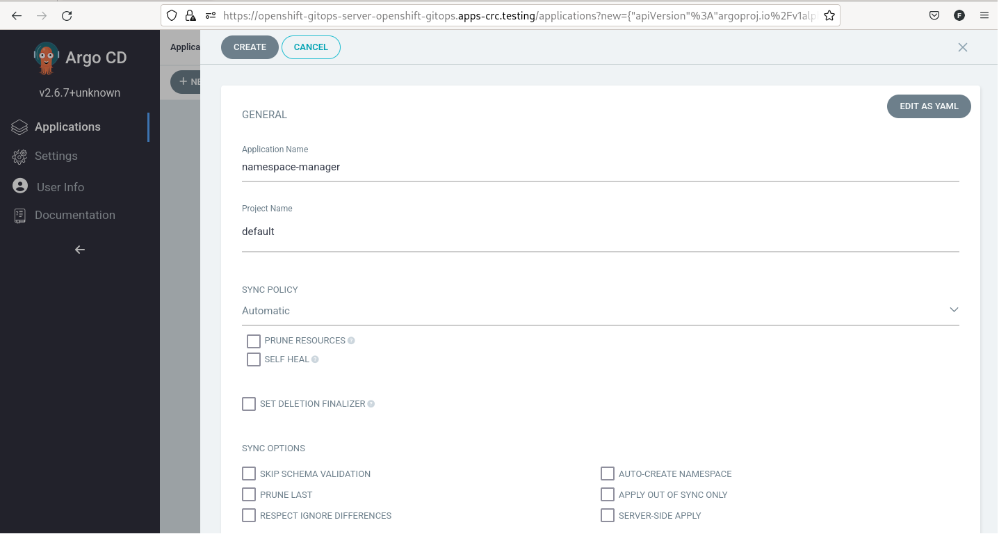
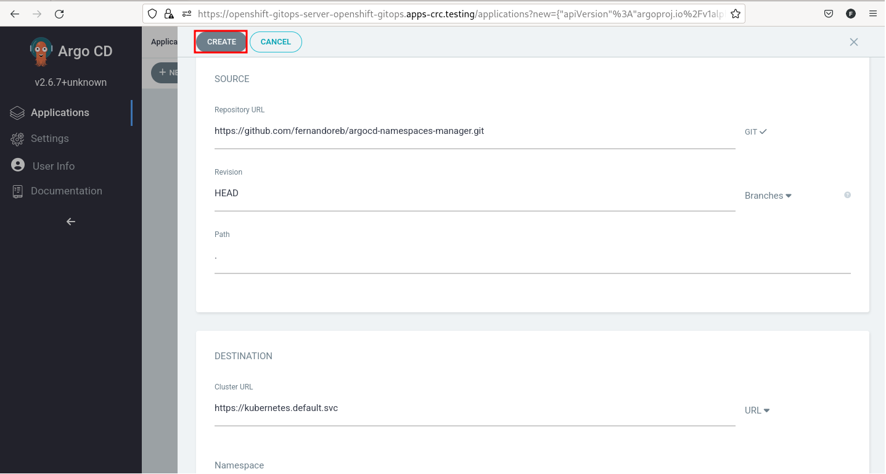
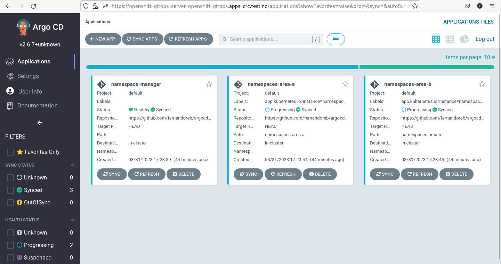
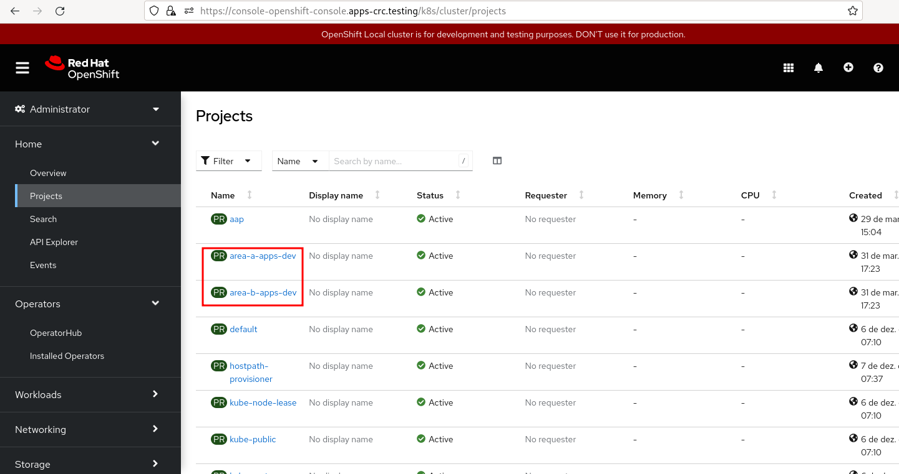
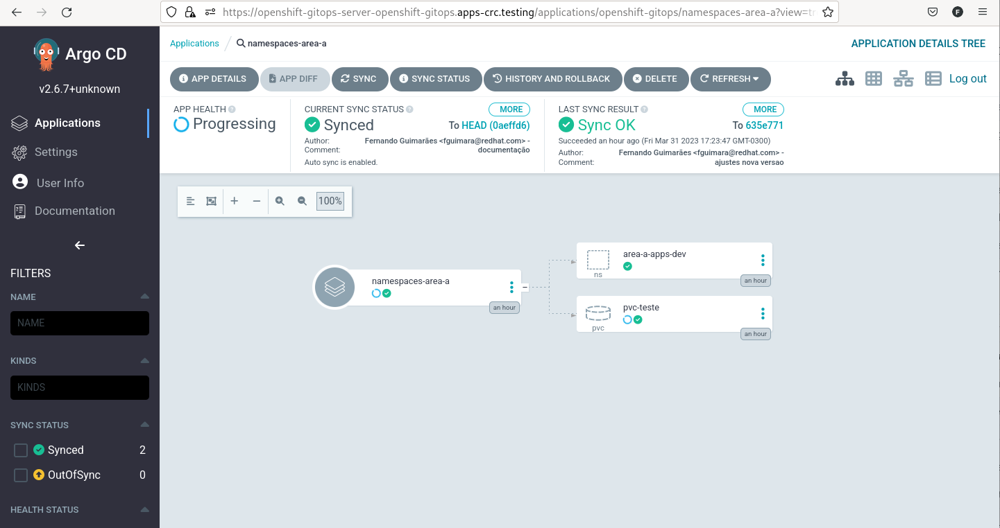

# Gitops - ArgoCD para gestão de Namespaces

Demostração de como utilizar o ArgoCD para gestionar namespaces com Openshift

Sobre o ArgoCD   
https://argoproj.github.io/

## Motivação

As vezes não queremos deixar a cargo dos times de desenvolvimento a criação de namespace, Storage Claim, Roles e outros recursos do cluster.  
Podemos utilizar o ArgoCD para fazer essa adminstração. Criando uma ou mais aplicações no Argo, para fazer a gestão de namespaces.  

Imaginemos um cenário onde as áreas A e B necessitam criar namespaces para as suas aplicações e criar um pvc. Poderíamos resolver com ArgoCD da seguinte forma:

## Laboratório

Openshift: 4.12 - Versão CRC

Seguem os passos para execução do laboratório.

### Arquivos do Projeto

Se pegarmos um dos diretórios das áreas, poderemos ver em values a estrutura:

namespaces-area-a/values.yaml
~~~
# Lista de namespaces a serem criados. Executar uma vez para criar os namespaces e depois criar os demais itens
namespaces:
  - area-a-apps-dev

# Lista de sufixos que serão aplicados como zonas
nodeSelectorNS:
  - dev
  - hmg
  - prd

pvcsByNS:
  - namespace: area-a-apps-dev
    pvcname: pvc-teste
    size: 1Gi
    accessMode: ReadWriteOnce
    storageClassName: crc-csi-hostpath-provisioner
~~~

Neste caso, criaremos uma namespace e um pcv. A estrutura permite a criação de várias namespaces e pvcs. Ainda estamos associando a uma zona se o sufixo conincidir com as zonas listas na tag nodeSelectorNS.
 
 É possível validar essa implementação em:  
 
 namespaces-area-a/templates/namespace.yaml
 ~~~
 {{ if .Values.namespaces }}

{{ range $namespace := .Values.namespaces }}

{{ $sufix := "default" }}

{{ if $.Values.nodeSelectorNS }}
{{ range $sufixTemp := $.Values.nodeSelectorNS }}

{{ if hasSuffix $sufixTemp $namespace }}

{{ $sufix = $sufixTemp }}

{{ end }}

{{ end }}
{{ end }}

{{ if eq "default" $sufix }}
---
apiVersion: v1
kind: Namespace
metadata:
  name: {{ $namespace }}
  annotations:
    helm.sh/resource-policy: keep
  labels:
{{ include "argocd-applications-manager.defaultLabels" . | indent 4 }}  
{{ else }}
---
apiVersion: v1
kind: Namespace
metadata:
  name: {{ $namespace }}
  annotations:
    helm.sh/resource-policy: keep
    openshift.io/node-selector: 'zone={{$sufix}}'
  labels:
{{ include "argocd-applications-manager.defaultLabels" . | indent 4 }}  

{{ end }}

{{ end }}
{{ end }}
~~~

### Instalação

Instalar o **Operator Red Hat OpenShift GitOps**, via Web Console   

Referência: 
https://docs.openshift.com/container-platform/4.12/cicd/gitops/installing-openshift-gitops.html

### Criação da aplicação de manutenção de namespaces: 

Após instalado, acesse o ArgoCD de acordo com a documentação oficial. Teremos algo como:

#### Adicionando o Repositório Git

Vá em Settings e Repositories

Selecione Connect Repo

Adicione as informações do repo e Connect. Pode-se utilizar um repo privado, bastando informar o usuário e senha.

No final o repositório será adicionado com sucesso.

#### Criando a aplicação de gestão de namespaces no ArgoCD

Selecione Applications e New App

Preencha de acordo com as images e clique em create

No final, teremos algo como:

Se olharmos no cluster veremos os projetos criados:

Se pegarmos o yaml de criação da namespace, podermos ver a zona definida:

node-selector: zone=dev
~~~
kind: Namespace
apiVersion: v1
metadata:
  name: area-a-apps-dev

  labels:
    app.kubernetes.io/instance: namespaces-area-a
    argocd.argoproj.io/managed-by: openshift-gitops
    kubernetes.io/metadata.name: area-a-apps-dev
    pod-security.kubernetes.io/audit: restricted
    pod-security.kubernetes.io/audit-version: v1.24
    pod-security.kubernetes.io/warn: restricted
    pod-security.kubernetes.io/warn-version: v1.24
  annotations:
    helm.sh/resource-policy: keep
    kubectl.kubernetes.io/last-applied-configuration: >
      {"apiVersion":"v1","kind":"Namespace","metadata":{"annotations":{"helm.sh/resource-policy":"keep","openshift.io/node-selector":"zone=dev"},"labels":{"app.kubernetes.io/instance":"namespaces-area-a","argocd.argoproj.io/managed-by":"openshift-gitops"},"name":"area-a-apps-dev"}}
    openshift.io/node-selector: zone=dev
    openshift.io/sa.scc.mcs: 's0:c27,c4'
    openshift.io/sa.scc.supplemental-groups: 1000710000/10000
    openshift.io/sa.scc.uid-range: 1000710000/10000
...
~~~

Se olharmos no argo, veremos os detalhes dos artefatos criados:

Podermos alterar o arquivo de values de cada área, adicionando ou removendo as namespaces, ficando a cargo do Argo a gestão e atualização.

## Conclusões

Utilizar o ArgoCD para gestionar as namespaces e recursos compartilhados por mais de um time ajudará a uma melhor gestão dos artefatos, além de se utilizar uma boa prática de GitOps.
